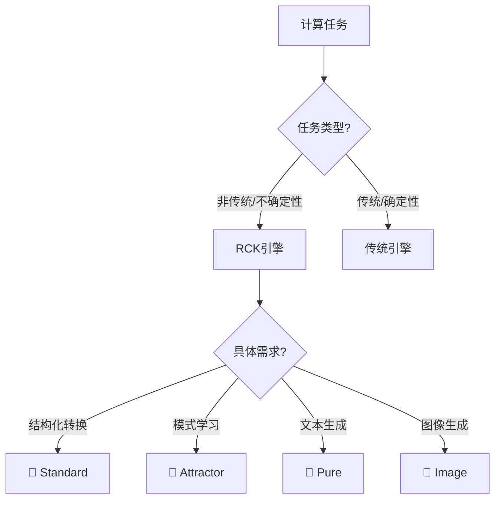

# Topos Pathless Service RCK Go SDK 完整教程

### 🎯 RCK：Pathless 中的非传统计算引擎

**RCK (Relational Calculate Kernel)** 是 Pathless 服务中的核心组件，专门负责**非传统、非确定性计算任务**的完整生命周期，包括：
- **编译**：将自然语言需求转换为可执行的计算逻辑
- **部署**：自动部署到云原生环境，无需手动干预
- **运行**：执行非确定性计算任务，支持动态调整
- **监控**：实时监控计算过程和结果质量

### 🎯 Pathless 核心理念：目标驱动，路径无关

传统编程思维：
```go
// 需要编写具体的算法步骤和实现细节
func processData(inputData []byte) (Result, error) {
    step1, err := parse(inputData)
    if err != nil { return nil, err }
    step2, err := validate(step1)
    if err != nil { return nil, err }
    step3, err := transform(step2)
    if err != nil { return nil, err }
    return step3, nil
}
```

Pathless 编程思维：
```go
// 只需要定义目标和约束，系统自动找到实现路径
result, err := client.Compute.StructuredTransform(ctx, compute.StructuredTransformParams{
    Input:         inputData,
    FunctionLogic: "提取关键信息并结构化",
    OutputDataClass: MySchema,
})
```

### 🌈 Pathless 核心价值

#### 1. 处理非标准化任务
- 直接处理自然语言、图像、音频等非结构化数据
- 生成标准化的结构化输出
- 无需手动实现复杂算法

#### 2. 支持模糊性和不确定性
- 通过概率性推理和模糊逻辑
- 有效处理开放性问题和动态场景
- 适应不断变化的业务规则

#### 3. 自然语言驱动
- 非程序员通过自然语言描述需求
- 系统自动理解并生成结果
- 无需编程技能和专业知识

#### 4. 动态适应规则变更
- 业务规则变化时，无需重写代码
- 实时调整，无需重新编译部署
- 开发周期从周缩短到分钟

#### 5. 云原生，无需管理
- 无需管理服务器和基础设施
- 直接通过 REST API 调用
- 跨平台兼容，适用于任何开发环境

### 📊 三维度对比：传统编程 vs Pathless

#### 1. 编程维度
| 特性 | 传统编程 | Pathless 新范式 |
|------|----------|------------------|
| **编程方式** | 需要编写代码 | 声明目的即编程 |
| **逻辑处理** | 只能处理确定性逻辑 | 支持模糊性和不确定性 |
| **数据依赖** | 依赖结构化数据 | 支持非结构化数据 |
| **规则变更** | 需要重写代码 | 动态适应规则变更 |
| **非标准化处理** | 无法直接处理 | 直接处理并标准化输出 |

#### 2. 运行维度
| 特性 | 传统编程 | Pathless 新范式 |
|------|----------|------------------|
| **运行环境** | 需要管理服务器 | 云原生，无需管理 |
| **调用方式** | 手动实现复杂逻辑 | 标准 REST API |
| **模态支持** | 仅支持单一模态 | 多模态，未来全模态 |
| **目标驱动** | 命令式编程 | 声明式编程 |

#### 3. 部署维度
| 特性 | 传统编程 | Pathless 新范式 |
|------|----------|------------------|
| **部署流程** | 需要编译部署 | 无需编译部署 |
| **动态适应** | 需要重新部署 | 动态调整 |
| **开发效率** | 周期长，成本高 | 流程高效，成本低 |

## 🏗️ Pathless 服务架构

Pathless 是一个完整的 AI 服务平台，包含多个专门的计算引擎来处理不同类型的任务：

### 🎯 RCK：非传统计算引擎

**RCK (Relational Calculate Kernel)** 是 Pathless 中专门负责**非传统、非确定性计算任务**的引擎，包含完整的计算生命周期：

1.  **🎯 Standard 引擎** - 通用AI计算，处理确定性转换任务
2.  **🧲 Attractor 引擎** - 基于示例学习的模式识别引擎
3.  **💫 Pure 引擎** - 自然语言生成，处理创意和文本任务
4.  **🎨 Image 引擎** - 多模态图像生成，处理视觉任务

### 🔧 传统计算引擎
Pathless 还包含传统的计算引擎来处理确定性、标准化任务，确保完整的功能覆盖。

### 📊 引擎选择策略


Go SDK 中的方法与 RCK 引擎的对应关系如下：

| SDK 方法 (`client.Compute.*` / `client.Image.*`) | RCK 引擎    | 描述                                     |
| ---------------------------------------------- | ----------- | ---------------------------------------- |
| **`StructuredTransform`**, **`Analyze`**, **`Translate`** | `standard`  | 通用AI计算，处理确定性转换任务           |
| **`LearnFromExamples`**                          | `attractor` | 基于示例学习的模式识别                   |
| **`GenerateText`**                               | `pure`      | 自然语言生成，处理创意和文本任务         |
| **`Generate`**                                   | `image`     | 多模态图像生成，处理视觉任务             |
| **`Auto`**                                       | `auto`      | 根据参数自动选择最合适的引擎执行任务     |

## 📦 安装

```bash
go get github.com/Askr-Omorsablin/rck-go-sdk
```

## 🎯 Pathless 适用场景

Pathless 特别适用于以下场景，解决传统编程难以处理的复杂问题：

### 1. 📄 非结构化数据处理
**场景**：从自由文本中提取结构化信息
```go
// 输入：非结构化文本
startPoint := "客户张三，电话13800138000，地址北京市朝阳区"

// 定义输出的 JSON Schema
schema := map[string]interface{}{
    "type": "object",
    "properties": map[string]interface{}{
        "name":    map[string]string{"type": "string", "description": "客户姓名"},
        "phone":   map[string]string{"type": "string", "description": "联系电话"},
        "address": map[string]string{"type": "string", "description": "地址信息"},
    },
    "required": []string{"name", "phone", "address"},
}

// 输出：结构化数据
response, err := client.Compute.StructuredTransform(ctx, compute.StructuredTransformParams{
    Input:           startPoint,
    FunctionLogic:   "提取客户姓名、电话和地址",
    OutputDataClass: schema,
})
if err != nil { /* ... handle error ... */ }

// 将结果解码到 Go 结构体
var result struct {
	Name    string `json:"name"`
	Phone   string `json:"phone"`
	Address string `json:"address"`
}
response.Decode(&result)

fmt.Println(result.Name)    // "张三"
fmt.Println(result.Phone)   // "13800138000"
fmt.Println(result.Address) // "北京市朝阳区"
```

### 2. ⚙️ 动态规则系统
**场景**：实时调整业务规则，无需重新部署
```go
// 业务规则变化时，只需修改自然语言描述
oldRule := "新客户首单享受九折优惠"
newRule := "新客户首单享受八五折优惠，VIP客户七折"
customerData := `{"name": "李四", "is_vip": true, "is_first_order": true}`
discountSchema := map[string]interface{}{"type": "object", "properties": map[string]interface{}{"discount_rate": map[string]string{"type": "string"}}}

// 无需重新部署代码，只需更新 FunctionLogic
response, err := client.Compute.StructuredTransform(ctx, compute.StructuredTransformParams{
    Input:           customerData,
    FunctionLogic:   newRule,  // 动态规则
    OutputDataClass: discountSchema,
})
// ... handle response ...
```

### 3. 🔄 复杂状态转换
**场景**：智能工作流引擎
```go
// 根据订单状态和物流信息自动决定下一步操作
orderInfo := `{"order_id": "123", "status": "shipped", "logistics_info": "arrived at destination city"}`
actionSchema := map[string]interface{}{"type": "object", "properties": map[string]interface{}{"next_action": map[string]string{"type": "string"}}}

response, err := client.Compute.StructuredTransform(ctx, compute.StructuredTransformParams{
    Input:           orderInfo,
    FunctionLogic:   "如果订单已送达目的地城市，下一步操作是'派送'；否则是'运输中'",
    OutputDataClass: actionSchema,
})
// ... handle response ...
```

### 4. 🧠 认知问题解决
**场景**：智能客服，法律文档分析
```go
// 分析客户投诉的核心问题并生成解决方案
complaintText := "我购买的手机屏幕有划痕，而且电池续航很差，客服回复太慢了。"
solutionSchema := map[string]interface{}{"type": "object", "properties": map[string]interface{}{
    "summary": map[string]string{"type": "string"},
    "solution": map[string]string{"type": "string"},
}}

response, err := client.Compute.StructuredTransform(ctx, compute.StructuredTransformParams{
    Input:           complaintText,
    FunctionLogic:   "分析客户投诉的核心问题，总结并生成解决方案（例如：换货、维修、补偿）",
    OutputDataClass: solutionSchema,
})
// ... handle response ...
```

### 5. 🧪 测试驱动开发
**场景**：生成真实的动态测试数据
```go
// 根据用户画像生成动态测试数据，模拟真实场景
userProfile := `{"age": 25, "city": "上海", "interests": ["购物", "旅游"]}`
testDataSchema := map[string]interface{}{"type": "object", "properties": map[string]interface{}{
    "username": map[string]string{"type": "string"},
    "email": map[string]string{"type": "string"},
    "password": map[string]string{"type": "string"},
}}

response, err := client.Compute.StructuredTransform(ctx, compute.StructuredTransformParams{
    Input:           userProfile,
    FunctionLogic:   "根据用户画像生成一个符合条件的虚拟用户信息",
    OutputDataClass: testDataSchema,
})
// ... handle response ...
```
